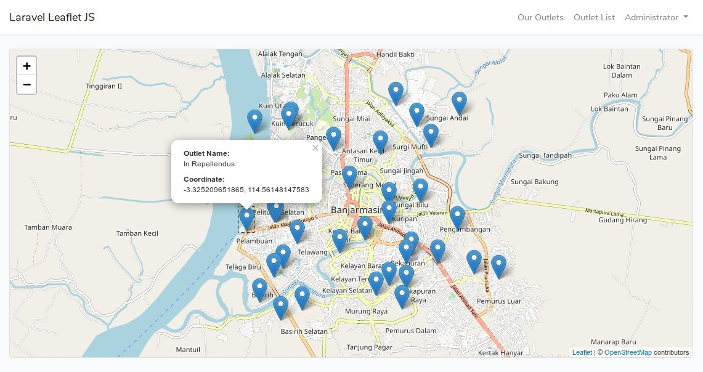

# Laravel Leaflet JS - Example

This is an example project for [Leaflet JS](https://leafletjs.com) and [OpenStreetMap](https://www.openstreetmap.org) built with Laravel 5.8.



## Features

In this project, we have an Outlet Management (CRUD) with localtion/coordinate point that shown in map. We also have coordinate entry with direct map pointing on Outlet Create and Edit form.

## Installation Steps

Follow this instructions to install the project:

1. Clone this repo.
    ```bash
    $ git clone git@github.com:nafiesl/laravel-leaflet-example.git
    # or
    $ git clone https://github.com/nafiesl/laravel-leaflet-example.git
    ```
2. `$ cd laravel-leaflet-example`
3. `$ composer install`
4. `$ cp .env.example .env`
5. `$ php artisan key:generate`
6. Set **database config** on `.env` file
7. `$ php artisan migrate`
8. `$ php artisan serve`
10. Open `https://localhost:8000` with browser.

### Demo Records

If we need some outlet demo records, we can use model factory within tinker:

```bash
$ php artisan tinker
>>> factory(App\Outlet::class, 30)->create();
```

### Leaflet config

We have a `config/leaflet.php` file in this project. Set default **zoom level** and **map center** coordinate here (or in `.env` file).

```php
<?php

return [
    'zoom_level'           => 13,
    'detail_zoom_level'    => 16,
    'map_center_latitude'  => env('MAP_CENTER_LATITUDE', '-3.313695'),
    'map_center_longitude' => env('MAP_CENTER_LONGITUDE', '114.590148'),
];
```

> Please note that this is not an official or required config file from Leaflet JS, it is just a custom config for this project.

## Testing

Run PHPUnit to run feature test:

```bash
$ vendor/bin/phpunit
```

## License

This project is open-sourced software licensed under the [MIT license](LICENSE).
